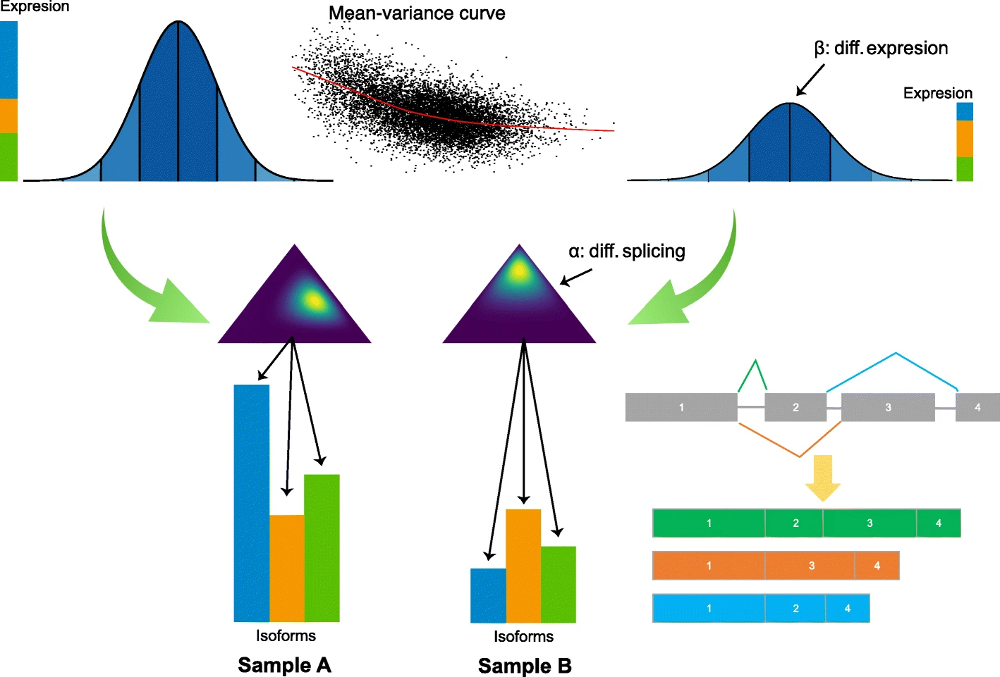

# Input files

isopret can be run with `HBA-DEALS`_ or `edgeR`_ results files as input.

## HBA-DEALS

Hierarchical Bayesian Analysis of Differential Expression and ALternative Splicing (HBA-DEALS)
simultaneously characterizes differential expression and splicing in cohorts.

<figure markdown>
{ width="1000" }
<figcaption>HBA-DEALS..</figcaption>
</figure>

The log-transformed expression of a gene with three isoforms (green, orange, and blue) is shown. The gene expression is the sum of the expression of the isoforms. Differential gene expression is modeled as two Normal distributions whose means differ by the parameter β. The proportions of the corresponding isoforms have a Dirichlet prior, and the difference in proportions between controls and cases is modeled by α (symbolized by the two triangles). An MCMC procedure is used to solve for the posterior distribution of the parameters of the model for all genes and isoforms at once.

The HBA-DEALS algorithm is explained in [Karlebach et al, 2020, Genome Biology 21:171](https://genomebiology.biomedcentral.com/articles/10.1186/s13059-020-02072-6).
Source code is available at the [HBA-DEALS GitHub repository](https://github.com/TheJacksonLaboratory/HBA-DEALS).

### Important

For use with isopret, HBA-DEALS *must* be run with the ``isoform.level`` option set to true.
See the [HBADEALS documentation](https://hba-deals.readthedocs.io/en/latest/)
for details.

## HBA-DEALS output format

HBA-DEALS produces an output file with the following format. A gene is shown
using its [Ensembl](http://ensembl.org/) identifier. If the word ``Expression``
appears in the second column, then the row refers to the gene, otherwise it
refers to the indicated transcript (isoform). The third column refers to the
expression log fold change (if the row refers to a gene) or the fold change
(if the row refers to an isoform). The fourth column is the posterior error probability (PEP; see
[Käll et al.](https://pubs.acs.org/doi/10.1021/pr700739d) for an explanation of PEP).

| Gene            |Isoform          | ExplogFC/FC     | P              |
|:----------------|:----------------|:----------------|:---------------|
| ENSG00000001629 | Expression      | 1.17010167106799| 0.19007        |
| ENSG00000001629 | ENST00000265742 | 1.17010167106799| 0.22928        |
| ENSG00000001629 | ENST00000422095 | 0.51809521525105| 0.04285        |
| ENSG00000001629 | ENST00000442183 | 1.04618237020161| 0.23606        |
| ENSG00000002586 | Expression      | 0.53692491414042| 0.05712        |
| ENSG00000002586 | ENST00000381177 | 1.63300567810385| 0.10156        |

IsopretGO currently supports
only [Ensembl](http://ensembl.org/) gene/transcript models.

## Running HBA-DEALS

A Snakemake pipeline for running HBA-DEALS is described in the
[GitHub repository](https://github.com/TheJacksonLaboratory/covid19splicing)
for the paper  [Betacoronavirus-specific alternate splicing](https://pubmed.ncbi.nlm.nih.gov/35074468/). The GitHub repository
also contains 15 HBA-DEALS output files related to that publication that can be used as input for Isopret-Gui.

# edgeR

Alternatively [edgeR](https://pubmed.ncbi.nlm.nih.gov/19910308/) can be used to call differential expresison and alternative splicing. We provide an R script to perform the analysis
and format the results in HBA-DEALS format (which is required to use isopret-GO):

[edgeR_output.R](../scripts/edgeR_output.R)